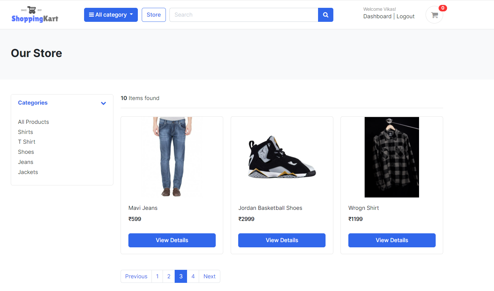
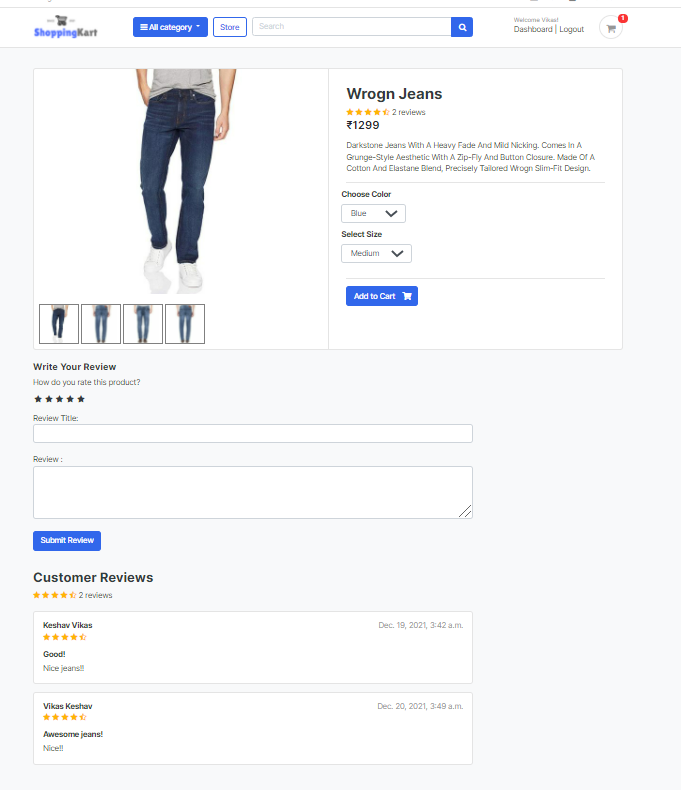
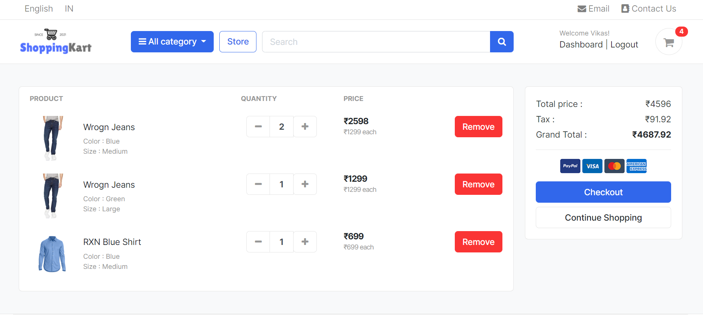
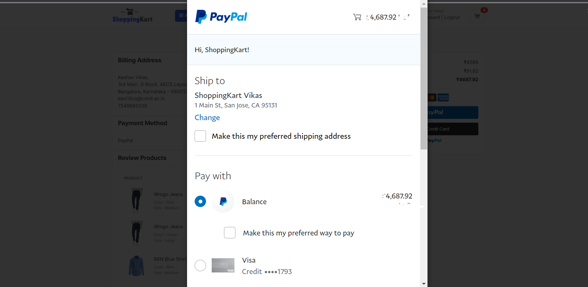

# ShoppingKart
> An eCommerce Web Application created with Python Django framework.
> Live demo [_here_](https://google.com). 

## Technologies Used
- Python Django Framework
- AWS Elastic Beanstalk
- RDS Postgres database
- AWS S3 Bucket
- AWS Route 53

## Features
- ### User Login System
  * Registration with account activation email
  * Login, Logout & Forgot Password
  
- ### My Account Management 
  * User Dashboard & Review Order
  * Edit User Profile & Change Password
  
- ### Product Display
  * Product display in categories
  * Paginator & Search Bar
  
- ### Shopping Cart
  * Add product of choosen variation to cart
  * Increment & Decrement quantity, Remove cart item
  
- ### Order and Payment
  * Place order with billing information
  * Payment by Paypal gateway
  * Generate invoice & Send notification email
  
- ### Review and Rating
  * Interactive rating stars and comment

# Home Page
  
 

  
 
 
 
# All Products Page
  
 

  
 
 
 
# Single Product Page
  
 

  
 
 
 
# My Cart Page
    
 

  
 
 
 
# Checkout Page
  
 

   

# Payment Page
  
 

   
  
  

# Paypal Integration Page
  
 

  
 
 
# Bill Generation Page
  
 

   
  

# User Dashboard Page
  
